

# Flyff-U-Launcher

**Inoffizieller Desktop-Launcher für Flyff Universe**
Multi-Accounts, Splitscreen, OCR-Overlays, Plugins und Live-News — alles in einer App.

> **Getestet auf:** Windows 11 | Linux Mint 22.3 — macOS Build verfügbar, aber noch nicht getestet.

> Der Launcher hält sich an die Spielregeln. Keine Automationen oder Eingriffe in das Spielgeschehen.

[English version below](#english)

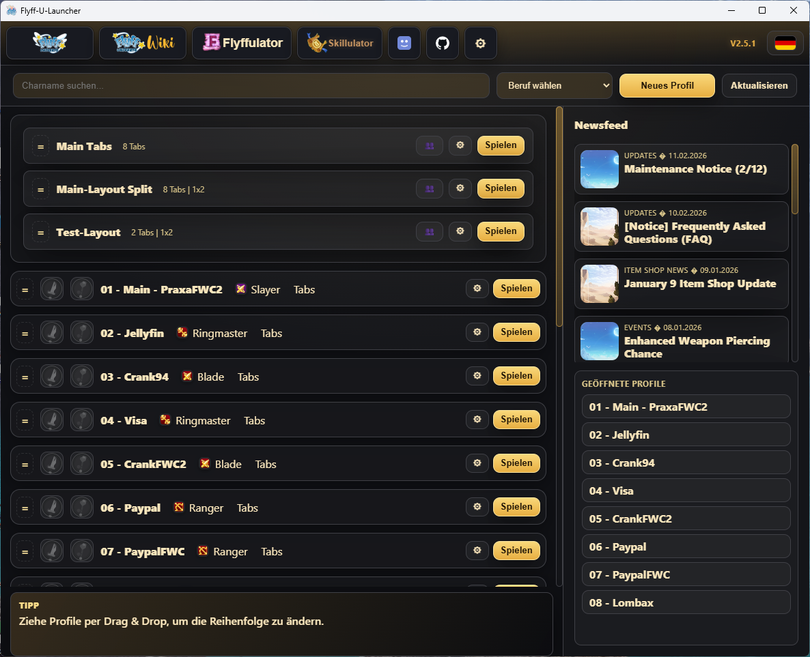

---

## Funktionen

### Multi-Profil-System
- Profile anlegen, umbenennen, klonen, löschen und per Drag & Drop sortieren
- Job/Badge pro Profil (Vagrant bis Crackshooter) mit Suchfeld und Job-Filter
- Startmodus pro Profil: **Tabs** (im Session-Fenster) oder **Fenster** (eigene Instanz)
- Overlay-Ziel bestimmen, welches Profil die OCR-Overlays und das Sidepanel erhält

### Layouts & Splitscreen
- **Grid-Layouts**: 1x1, 1x2, 1x3, 1x4, 2x2, 3+2, 2x3, 4+3, 2x4
- Layouts speichern/laden — per Klick mehrere Charaktere gleichzeitig starten
- Auto-Save und optionaler Layout-Delay für sequentielles Laden
- Multi-Window: Mehrere unabhängige Session-Fenster parallel nutzen
- **Hover-Fokus**: Spielfenster wechseln den Fokus durch Hovern — kein Alt+Tab oder Klick nötig
- Fortschrittsanzeige beim Laden der Spielinstanzen

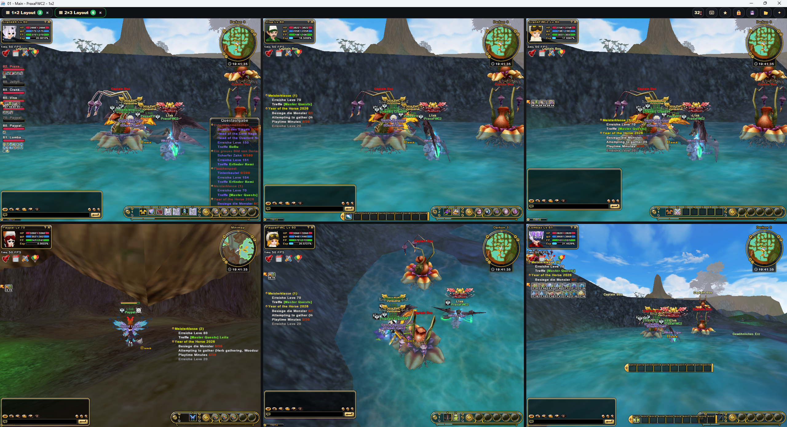
 2x3 Grid-Layout — 6 Spielinstanzen gleichzeitig

 

 Splitscreen mit Sidepanel und Overlays

### OCR & Overlays
- **ROI-Kalibrator**: Regionen für Level, Charname, EXP % und Lauftext per Screenshot markieren
- **Live-OCR**: Werte werden in Echtzeit ausgelesen, eigene Scan-Intervalle pro Feld
- Schwebendes Zahnrad-Overlay folgt dem aktiven Profil — Klick öffnet das Sidepanel
- Overlays sind klick-durchlässig und werden bei Inaktivität automatisch ausgeblendet
- OCR nutzt das mitgelieferte Tesseract — keine separate Installation nötig

### Hotkeys
Frei belegbare Tastenkombinationen (2–3 Tasten) für:
- Overlays/Sidepanel/Tab-Leiste ein/aus
- Tab-Navigation (Vorheriger/Nächster Tab, Nächstes Fenster)
- Screenshot speichern
- CD-Timer zurücksetzen
- FCoins-Rechner und Premium-Einkaufsliste öffnen

### Themes & Sprachen
- Fertige Themes: Toffee, Zimt, Flyff Gold, Synthwave, Steel Ruby, Holz u.v.m.
- Aktive Tabfarbe per Palette, Gradient oder Farbcode anpassen
- Animierte Akzente für Tabs und Panels
- **8 Sprachen**: Deutsch, English, Polski, Francais, Русский, Türkce, 中文, 日本語

### Integrierte Tools

<table>
<tr>
<td align="center">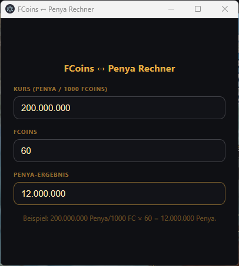 FCoins-Rechner</td>
<td align="center">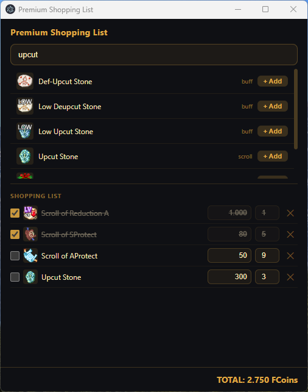 Premium-Einkaufsliste</td>
</tr>
<tr>
<td align="center" colspan="2"><strong>Upgrade-Kosten-Rechner</strong></td>
</tr>
<tr>
<td align="center">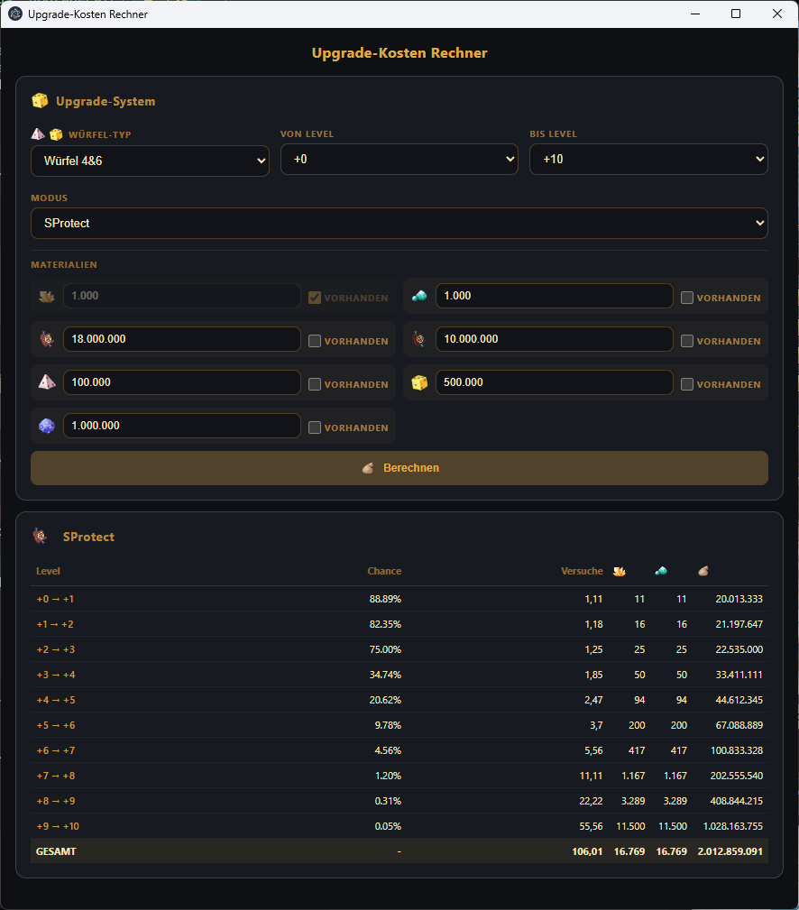 Kostenaufstellung pro Stufe</td>
<td align="center">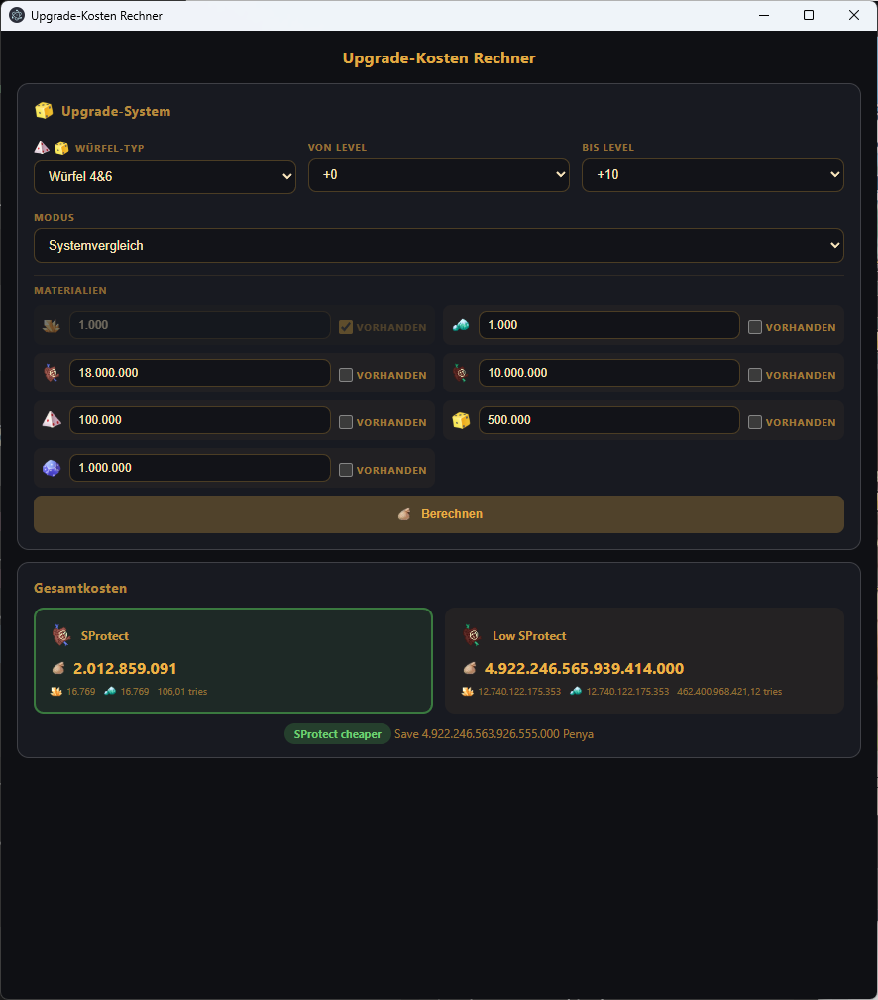 Vergleich S-Protect vs. Low S-Protect</td>
</tr>
</table>

- **Upgrade-Kosten-Rechner**: Erwartete Kosten für Item-Upgrades (+0 bis +10) berechnen — Materialbedarf, Versuchsanzahl und Vergleich Low S-Protect vs. S-Protect
- **FCoins-Rechner**: FCoins zu Penya umrechnen mit einstellbarem Wechselkurs
- **Premium-Einkaufsliste**: Items und Preise verwalten, Gesamtkosten in FCoins berechnen
- **Logs**: Live-Fehlerprotokoll (Warn/Error) im Sidepanel mit Lösch- und Speicherfunktion
- **Schnellzugriffe**: Flyff Universe, Flyffipedia, Flyffulator, Skillulator, Discord

---

## Plugins

Plugins werden im plattformspezifischen Datenverzeichnis unter `plugins/` abgelegt und erscheinen automatisch im Sidepanel.

| Plugin | Beschreibung |
|--------|-------------|
| **Killfeed** | EXP-Tracker mit Kill-Erkennung, Monster-Statistiken und detaillierter History (CSV) pro Profil. Derzeit nur im 1on1-Modus unterstützt — bei Charakterwechsel kann es zu Verwechslungen kommen. |
| **Giant Tracker** | Kill-Statistiken für Giants, Violets und Bosse — mit Drop-Tracking, Loot-Pool-Vorschau und Time-to-Kill (TTK) |
| **CD-Timer** | Timer für Buffs und Power-Ups — Icons warnen bei Ablauf |
| **API-Fetch** | Flyff-Universe-API-Daten herunterladen — native Sidepanel-Oberfläche (kein separates Fenster) |

### Killfeed

<table>
<tr>
<td align="center">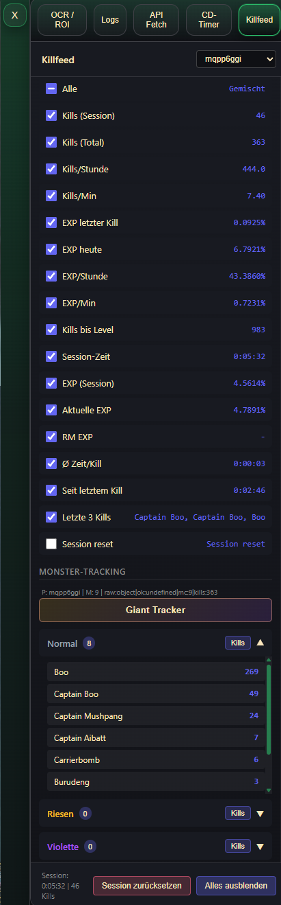 Sidepanel — Statistiken und Monster-Tracking</td>
<td align="center">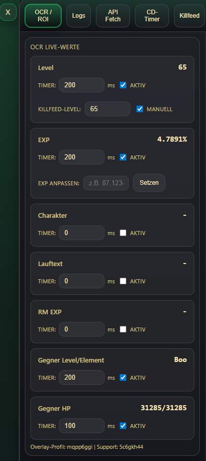 OCR Live-Werte und Timer</td>
</tr>
</table>
 
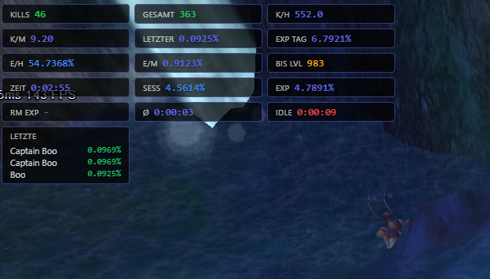
 In-Game Overlay — Live-Statistiken direkt im Spiel

### Giant Tracker

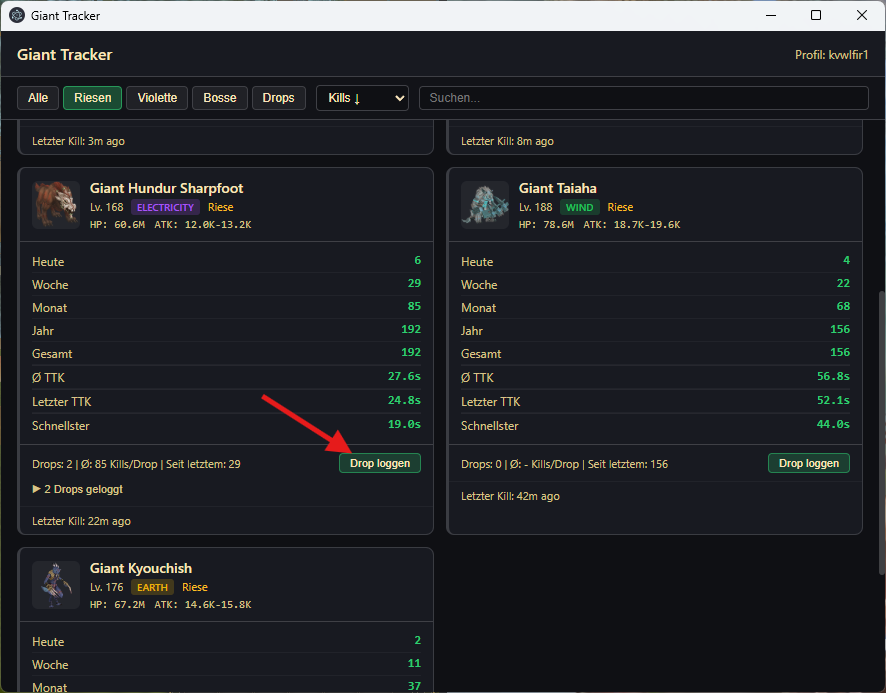
 Kill-Statistiken mit Time-to-Kill, Drop-Tracking und Zeitraum-Filter

 

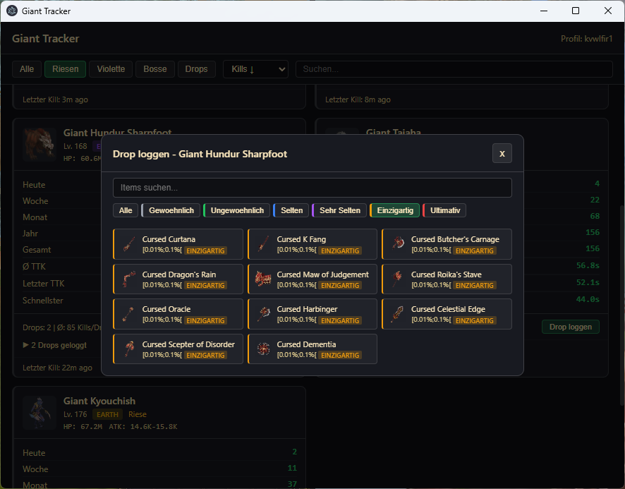
 Drop loggen mit Loot-Pool-Vorschau und Seltenheitsfilter

### CD-Timer

<table>
<tr>
<td align="center">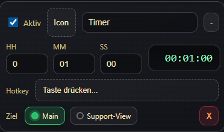 Timer konfigurieren</td>
<td align="center">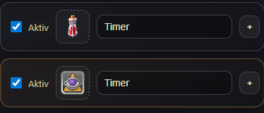 Einzeln anwählbar</td>
</tr>
</table>
 
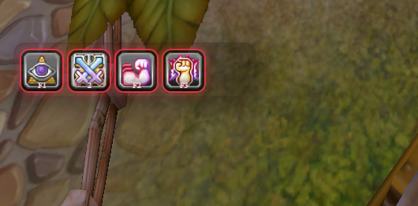
 In-Game Overlay — Icons warnen bei Ablauf

### API-Fetch

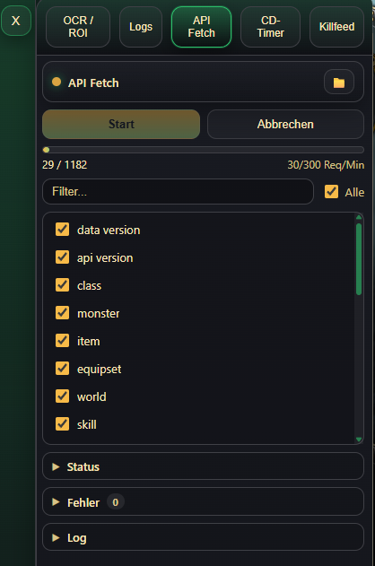
 API-Download im Sidepanel

---

## Installation

| Plattform | Download | Datei |
|-----------|----------|-------|
| **Windows** | [Neueste Version](https://github.com/GH-Praxa/Flyff-U-Launcher/releases) | `.exe` Setup |
| **macOS** | [Neueste Version](https://github.com/GH-Praxa/Flyff-U-Launcher/releases) | `.dmg` |
| **Linux** | [Neueste Version](https://github.com/GH-Praxa/Flyff-U-Launcher/releases) | `.AppImage` / `.deb` / `.rpm` |

1. Passende Datei herunterladen und installieren
2. Launcher starten
3. Tipp: Erklärungen in Einstellungen -> Dokumentation

Tesseract (OCR) und Sharp (Bildverarbeitung) sind im Launcher enthalten — keine separate Installation nötig.
Der Launcher aktualisiert sich automatisch, sobald eine neue Version verfügbar ist.

> **Ist der Download sicher?**
> Alle Release-Dateien werden automatisiert über GitHub Actions direkt aus dem öffentlichen Quellcode erstellt – ohne manuelle Änderungen. Das bedeutet: Der veröffentlichte Code entspricht exakt dem, was du herunterladen kannst.
>
> Wenn du dennoch Zweifel hast, lade die Dateien bitte nicht herunter. Sicherheit geht immer vor.

---

## Speicherort

| Plattform | Pfad |
|-----------|------|
| **Windows** | `%APPDATA%\Flyff-U-Launcher\user\` |
| **macOS** | `~/Library/Application Support/Flyff-U-Launcher/user/` |
| **Linux** | `~/.config/Flyff-U-Launcher/user/` |

Profile, Layouts, Themes, Plugin-Daten und OCR-Kalibrierungen.

---

## Hinweis

Dieses Projekt ist ein unabhängiges Fan-Projekt und steht in keiner Verbindung zu Gala Lab Corp., Sniegu oder Flyff Universe. Alle Markenzeichen und eingetragenen Marken sind Eigentum ihrer jeweiligen Inhaber.

Lizenz: [GPL-3.0](LICENSE)

---

# English

---

**Unofficial desktop launcher for Flyff Universe**
Multi-accounts, splitscreen, OCR overlays, plugins, and live news — all in one app.

> **Tested on:** Windows 11 | Linux Mint 22.3 — macOS build available but not yet tested.

> The launcher follows the game rules. No automation or interference with gameplay.

---

## Features

### Multi-Profile System
- Create, rename, clone, delete, and drag & drop sort profiles
- Job/badge per profile (Vagrant to Crackshooter) with search and job filter
- Launch mode per profile: **Tabs** (inside session window) or **Window** (separate instance)
- Overlay target determines which profile receives OCR overlays and the side panel

### Layouts & Splitscreen
- **Grid layouts**: 1x1, 1x2, 1x3, 1x4, 2x2, 3+2, 2x3, 4+3, 2x4
- Save/load layouts — launch multiple characters at once with a single click
- Auto-save and optional layout delay for sequential loading
- Multi-window: Use multiple independent session windows in parallel
- **Hover focus**: Game windows switch focus on hover — no Alt+Tab or clicking required
- Progress bar shows loading status for game instances

 2x3 grid layout — 6 game instances simultaneously

 

 Splitscreen with side panel and overlays

### OCR & Overlays
- **ROI calibrator**: Mark regions for level, character name, EXP %, and ticker text via screenshot
- **Live OCR**: Values are read in real time with custom scan intervals per field
- Floating gear overlay follows the active profile — click to open the side panel
- Overlays are click-through and auto-hide when the window is inactive
- OCR uses the bundled Tesseract — no separate installation required

### Hotkeys
Freely assignable key combinations (2–3 keys) for:
- Toggle overlays/side panel/tab bar
- Tab navigation (previous/next tab, next window)
- Save screenshot
- Reset CD timer
- Open FCoins calculator and premium shopping list

### Themes & Languages
- Built-in themes: Toffee, Cinnamon, Flyff Gold, Synthwave, Steel Ruby, Wood, and more
- Customize active tab color via palette, gradient, or color code
- Animated accents for tabs and panels
- **8 languages**: Deutsch, English, Polski, Francais, Русский, Türkce, 中文, 日本語

### Built-in Tools

<table>
<tr>
<td align="center"> FCoins Calculator</td>
<td align="center"> Premium Shopping List</td>
</tr>
<tr>
<td align="center" colspan="2"><strong>Upgrade Cost Calculator</strong></td>
</tr>
<tr>
<td align="center"> Cost breakdown per level</td>
<td align="center"> S-Protect vs. Low S-Protect comparison</td>
</tr>
</table>

- **Upgrade Cost Calculator**: Calculate expected costs for item upgrades (+0 to +10) — material requirements, number of attempts, and Low S-Protect vs. S-Protect comparison
- **FCoins Calculator**: Convert FCoins to Penya with adjustable exchange rate
- **Premium Shopping List**: Manage items and prices, calculate total cost in FCoins
- **Logs**: Live error log (Warn/Error) in the side panel with delete and save actions
- **Quick Links**: Flyff Universe, Flyffipedia, Flyffulator, Skillulator, Discord

---

## Plugins

Drop plugins into the platform-specific data directory under `plugins/` — they appear automatically in the side panel.

| Plugin | Description |
|--------|------------|
| **Killfeed** | EXP tracker with kill detection, monster statistics, and detailed per-profile history (CSV). Currently only supported in 1on1 mode — character switches may cause misattribution. |
| **Giant Tracker** | Kill statistics for Giants, Violets, and Bosses — with drop tracking, loot pool preview, and time-to-kill (TTK) |
| **CD-Timer** | Timers for buffs and power-ups — icons warn on expiry |
| **API-Fetch** | Download Flyff Universe API data — native side panel interface (no separate window) |

### Killfeed

<table>
<tr>
<td align="center"> Side panel — statistics and monster tracking</td>
<td align="center"> OCR live values and timers</td>
</tr>
</table>
 

 In-game overlay — live statistics directly in the game

### Giant Tracker

 Kill statistics with time-to-kill, drop tracking, and time range filter

 

 Log drops with loot pool preview and rarity filter

### CD-Timer

<table>
<tr>
<td align="center"> Configure timers</td>
<td align="center"> In-game overlay</td>
</tr>
</table>
 

 In-game overlay — icons warn on expiry

### API-Fetch

 API download in the side panel

---

## Installation

| Platform | Download | File |
|----------|----------|------|
| **Windows** | [Latest Release](https://github.com/GH-Praxa/Flyff-U-Launcher/releases) | `.exe` Setup |
| **macOS** | [Latest Release](https://github.com/GH-Praxa/Flyff-U-Launcher/releases) | `.dmg` |
| **Linux** | [Latest Release](https://github.com/GH-Praxa/Flyff-U-Launcher/releases) | `.AppImage` / `.deb` / `.rpm` |

1. Download the appropriate file and install
2. Launch the application
3. Tip: See Settings -> Documentation for detailed guides

Tesseract (OCR) and Sharp (image processing) are bundled with the launcher — no separate installation required.
The launcher updates itself automatically when a new version is available.

> **Is the download safe?**
> All release files are built automatically via GitHub Actions directly from the public source code – no manual modifications. This means: the published code is exactly what you download.
>
> If you still have doubts, please do not download the files. Safety always comes first.

---

## Storage

| Platform | Path |
|----------|------|
| **Windows** | `%APPDATA%\Flyff-U-Launcher\user\` |
| **macOS** | `~/Library/Application Support/Flyff-U-Launcher/user/` |
| **Linux** | `~/.config/Flyff-U-Launcher/user/` |

Profiles, layouts, themes, plugin data, and OCR calibrations.

---

## Disclaimer

This is an independent fan project and is not affiliated with Gala Lab Corp., Sniegu, or Flyff Universe. All trademarks and registered trademarks are the property of their respective owners.

License: [GPL-3.0](LICENSE)